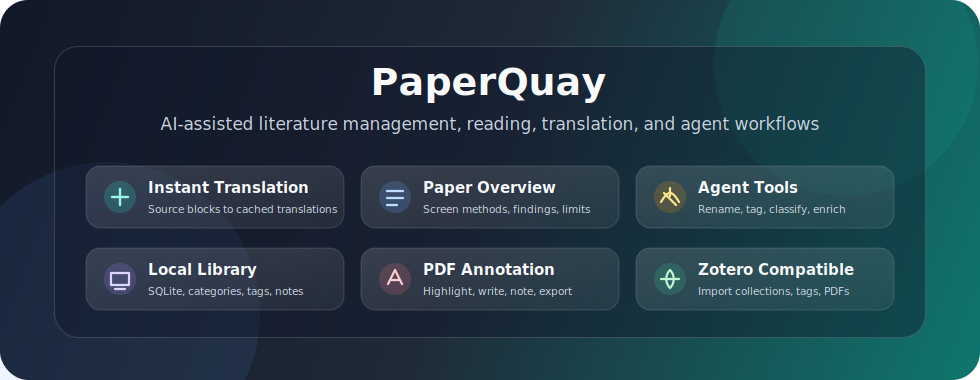
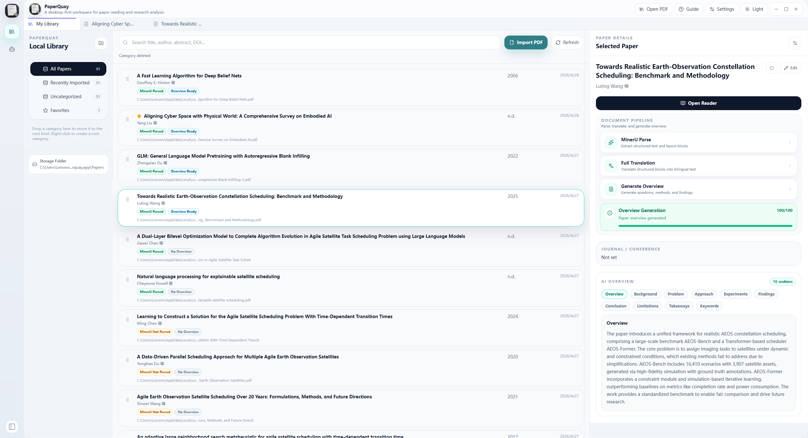
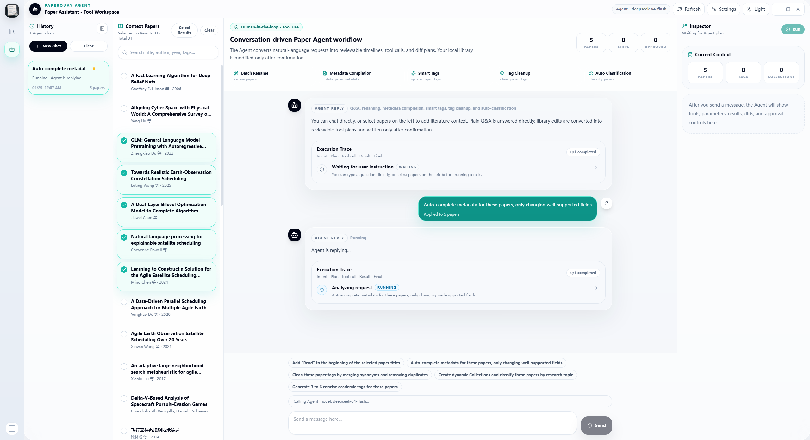

<h1 align="center">PaperQuay</h1>

<p align="center">
  中文 | <a href="./README.md">English</a>
</p>

<p align="center">
  <strong>桌面端优先的 AI 辅助文献管理软件，面向 PDF 阅读、全文翻译、论文概览和 Agent 工作流。</strong>
</p>

<p align="center">
  
  
  
  
  
  
</p>

<p align="center">
  <a href="#快速导航">快速导航</a> ·
  <a href="#paperquay--保持阅读心流的-ai-文献管理软件">为什么选择 PaperQuay</a> ·
  <a href="#当前功能">功能</a> ·
  <a href="#第一次使用流程">快速开始</a> ·
  <a href="#本地开发">开发</a>
</p>

<p align="center">
  
</p>


---

## 快速导航

<p>
  <a href="#paperquay--保持阅读心流的-ai-文献管理软件">问题与定位</a> ·
  <a href="#paperquay-有什么不同">差异点</a> ·
  <a href="#核心工作流">核心工作流</a> ·
  <a href="#当前功能">当前功能</a> ·
  <a href="#技术架构">技术架构</a> ·
  <a href="#zotero-兼容">Zotero 兼容</a> ·
  <a href="#后续计划">后续计划</a>
</p>

---

## PaperQuay — 保持阅读心流的 AI 文献管理软件

**PaperQuay 不只是一个 PDF 阅读器，也不只是 Zotero 的附属工具。** 它是一款本地优先的桌面端文献管理软件，面向学生、研究人员和论文写作者，目标是在同一个工作区完成文献管理、PDF 阅读、批注笔记、全文翻译、论文速读和 Agent 辅助管理。

很多论文工具会把工作流拆得很碎：一个软件读 PDF，一个工具做翻译，一个聊天窗口生成论文概述，再用另一个文献管理器维护元数据。PaperQuay 希望把这些操作合并到一个桌面端流程中，同时保留 Zotero 兼容能力，但不把 Zotero 作为必要依赖。

| 科研工作流痛点         | 传统工具                              | PaperQuay                                        |
| ---------------------- | ------------------------------------- | ------------------------------------------------ |
| 翻译延迟打断阅读       | 通常需要划词后等待 API 返回           | 提前翻译 MinerU 结构块，阅读时瞬间跳转到缓存译文 |
| 左右对照影响专注       | 两栏来回扫视，格式也很难绝对保持      | 保留原始 PDF，需要时跳转到精确对应译文           |
| 纯中文文件丢失原文语境 | 原文用词、术语和学术表达被隐藏        | 原文、结构块、译文、笔记和概览保持关联           |
| 大量论文速读很繁琐     | 反复上传 PDF 给大模型，再手动整理结果 | 在本地文献库中生成并保存结构化论文概览           |
| AI 模型选择受限        | 只能用内置模型或平台计费规则          | 支持自定义 OpenAI 兼容接口、模型和运行参数       |
| 大型文献库难维护       | 重命名、标签、元数据和分类主要靠手动  | Agent 可辅助批量重命名、元数据补全、打标签和分类 |
| Zotero 迁移不方便      | 要么继续依赖 Zotero，要么手动重建     | 可选导入 Zotero 分类、标签和 PDF 附件            |

---

## PaperQuay 有什么不同

<p align="center">
  
</p>

<p align="center">
  <em>动态流程演示：从文库浏览、打开论文、查看结构化阅读，到进入 Agent 工作区，整个过程都在同一个桌面工作流内完成。</em>
</p>

### 块级瞬间跳转翻译

PaperQuay 使用更适合长时间论文阅读的翻译范式。它可以提前翻译并缓存 MinerU 解析出的结构块。之后阅读时，点击原文块即可快速跳转到对应译文，翻译不再必须发生在每次点击或划词之后。

### 论文速读概览页

PaperQuay 不只适合精读，也适合大批量速读筛选论文。在概览页中，每篇论文都可以直接展示由大模型生成的背景、研究问题、方法、实验设置、主要发现、结论和局限等信息。你可以先在文库工作流里快速判断一篇论文是否值得深入阅读，再决定是否进入全文精读。

### 独立文献库，而不是只做导入

PaperQuay 可以独立建立本地文献库，支持 PDF 导入、默认文献存储文件夹、分类、标签、元数据编辑、搜索筛选、笔记和 SQLite 本地持久化。Zotero 仍然兼容，但只是可选导入来源。

### 面向文献管理的 Agent 操作

Agent 工作区不是普通聊天框，而是面向文献库操作设计。它可以辅助批量重命名、元数据补全、智能标签、标签清洗、自动分类和论文总结，并展示工具调用过程和执行结果，方便用户确认。

---


## 核心工作流

| 步骤            | 发生什么                                                        |
| --------------- | --------------------------------------------------------------- |
| 1. 导入 PDF     | 将 PDF 拖入软件，或从导入窗口选择文件。                         |
| 2. 确认元数据   | 检查标题、作者、年份、期刊、DOI、摘要、关键词和重复提示。       |
| 3. 整理文献库   | 创建分类，把论文拖入 collection，添加标签并标记收藏。           |
| 4. MinerU 解析  | 将 PDF 转成结构化块，并建立页面区域关联。                       |
| 5. 生成论文概览 | 保存可复用的论文速读结果，便于后续筛选和回顾。                  |
| 6. 全文翻译     | 缓存翻译后的结构块，让阅读时可以瞬间切换原文与译文。            |
| 7. 阅读与批注   | 高亮、写字、添加笔记、跳转批注，并导出批注后的 PDF。            |
| 8. 使用 Agent   | 让 Agent 对选中文献执行重命名、分类、打标签、补全元数据或总结。 |

---
## PaperQuay 截图
<p align="center">
  
</p>

<p align="center">
  <em>主文库界面：在同一个桌面视图中管理论文、分类、元数据、阅读进度和 AI 生成的概览。</em>
</p>

<p align="center">
  
</p>

<p align="center">
  <em>Agent 工作区：与论文助手对话、查看执行轨迹、审查工具调用，并在确认后执行批量文库操作。</em>
</p>

---
## 当前功能

| 模块         | 已支持能力                                                                        |
| ------------ | --------------------------------------------------------------------------------- |
| 本地文献库   | 使用 SQLite 保存论文、作者、分类、标签、附件、笔记、批注和导入记录                |
| PDF 导入     | 支持文件选择器和拖拽导入，入库前进入导入确认窗口                                  |
| 文件管理     | 支持文献存储文件夹、复制 / 移动 / 保留原路径、命名规则和原始路径记录              |
| 元数据       | 支持通过 DOI 或标题调用 Crossref 补全，导入前可手动编辑                           |
| 分类树       | 支持系统分类、自定义分类、子分类、折叠、右键菜单、拖拽排序和层级调整              |
| 文献详情     | 支持标题、作者、年份、期刊 / 会议、DOI、URL、摘要、关键词、标签、笔记、引用和收藏 |
| 阅读器       | 支持 PDF 阅读、MinerU 结构块视图和 PDF 区域联动                                   |
| 翻译         | 支持全文翻译、块级翻译缓存和划词翻译，模型使用 OpenAI 兼容接口                    |
| 论文概览     | 支持背景、研究问题、方法、实验设置、主要发现、结论和局限等速读概览字段            |
| Agent 工作区 | 支持对话、执行轨迹、工具调用卡片、文献选择、元数据工具、重命名、打标签和分类      |
| Zotero 导入  | 支持从 `zotero.sqlite` 导入 Zotero 分类、标签和可用 PDF 附件                      |
| 主题         | 支持浅色和深色主题，面向桌面端长时间阅读优化                                      |

---

## 第一次使用流程

1. 打开设置，选择默认文献存储文件夹。
2. 通过拖拽或导入按钮添加 PDF。
3. 在导入确认窗口中检查或修改元数据。
4. PaperQuay 会复制 PDF 到文献库存储文件夹，并写入本地 SQLite 数据库。
5. 在左侧创建分类和子分类。
6. 将文献拖入分类，添加标签，标记收藏，然后打开阅读。
7. 如需 AI 功能，在设置中配置 OpenAI 兼容接口和模型。
8. 如需 MinerU 解析，在设置中配置 MinerU API key。
9. 如果已有 Zotero 文库，可以在设置中选择 Zotero 数据目录并导入分类和 PDF。

---

## 技术架构

PaperQuay 是桌面应用优先，不是普通网页外面套一层壳。

| 路径                       | 职责                                                                               |
| -------------------------- | ---------------------------------------------------------------------------------- |
| `src/`                     | React + TypeScript 前端界面、功能模块、状态和服务层                                |
| `src/features/literature/` | 本地文献库、导入流程、分类树和文献详情                                             |
| `src/features/reader/`     | 阅读器外壳、联动阅读工作区、设置、新手引导和 AI 阅读动作                           |
| `src/features/pdf/`        | PDF 渲染、覆盖层、批注表面和 PDF 交互                                              |
| `src/features/blocks/`     | MinerU 块渲染和结构化内容视图                                                      |
| `src/features/agent/`      | Agent 对话界面、执行轨迹、工具卡片和文献库操作入口                                 |
| `src/services/`            | 前端到 Tauri commands 的调用封装                                                   |
| `src-tauri/src/commands/`  | Rust 命令，包括文件、SQLite、Zotero、MinerU、元数据、翻译、概览、问答和 Agent 操作 |
| `src-tauri/`               | Tauri v2 配置、图标、安装包资源和 Rust crate                                       |

---

## 环境要求

- Node.js 18 或更高版本
- Rust stable 工具链
- 当前操作系统对应的 Tauri v2 依赖
- Windows、macOS 或 Linux

可选外部服务：

- MinerU API key：用于云端 PDF 结构解析。
- OpenAI 兼容 API key：用于论文概览、翻译、问答和 Agent。
- 网络连接：用于 Crossref 元数据补全。

---

## 本地开发

安装依赖：

```bash
npm install
```

启动桌面开发模式：

```bash
npm run tauri:dev
```

只构建前端：

```bash
npm run build
```

检查 Rust 宿主：

```bash
cd src-tauri
cargo check
```

构建桌面安装包：

```bash
npm run tauri:build
```

---

## Zotero 兼容

PaperQuay 可以读取包含 `zotero.sqlite` 的 Zotero 本地数据目录。导入时会将 Zotero 数据库复制到临时只读文件中读取，不会修改 Zotero 原始数据库。

导入结果会进入 PaperQuay 自己的本地文献库。Zotero collections 会变成本地分类，分类下可访问的本地 PDF 会复制到 PaperQuay 的文献存储文件夹中。

Zotero 是 PaperQuay 的兼容来源之一，不是必要依赖。你可以完全不使用 Zotero，直接在 PaperQuay 中建立自己的文献库。

---

## 数据与隐私

PaperQuay 是本地优先。文献数据库保存为 SQLite，导入的 PDF 保存到你配置的文献存储文件夹中。

不要提交本地数据、API key、PDF、解析结果或备份文件。当前 `.gitignore` 已默认排除运行时目录、SQLite 数据库、API key 文件、构建产物、备份包和私人 PDF。

---

## 后续计划

- 从 PDF 首页提取更稳定的元数据。
- 增加 DOI / arXiv / Semantic Scholar 补全来源。
- 完善 PDF 高级标注和导出。
- 增加引用格式生成。
- 增加数据库备份和恢复界面。
- 增加文件夹监听和自动导入队列。
- 增加 RAG 知识库问答。
- 支持一键生成综述、Word / LaTeX 草稿等研究写作能力。
- 本地优先模型稳定后，再考虑可选云同步。

---

## 致谢

PaperQuay 的不少设计与打磨，也受到了 [LinuxDo 社区](https://linux.do/) 讨论、反馈和想法的启发。

---

## 许可证

PaperQuay Community Edition 使用 `AGPL-3.0-only` 许可证。

如果你分发修改后的版本，或把修改后的版本作为网络服务提供给用户，需要保留许可证和版权声明，说明修改内容，并按 AGPL 要求提供对应源代码。闭源商业授权、商业支持或品牌名称使用许可需要与维护者另行协商。品牌使用说明见 [TRADEMARKS.md](./TRADEMARKS.md)。
